# HiveMind Architecture Diagrams

Below are the generic HiveMind diagrams (auto-generated, labeled sequentially).

## Diagram 1
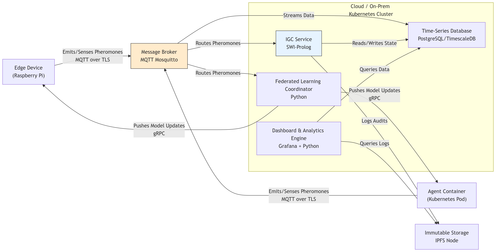

## Diagram 2
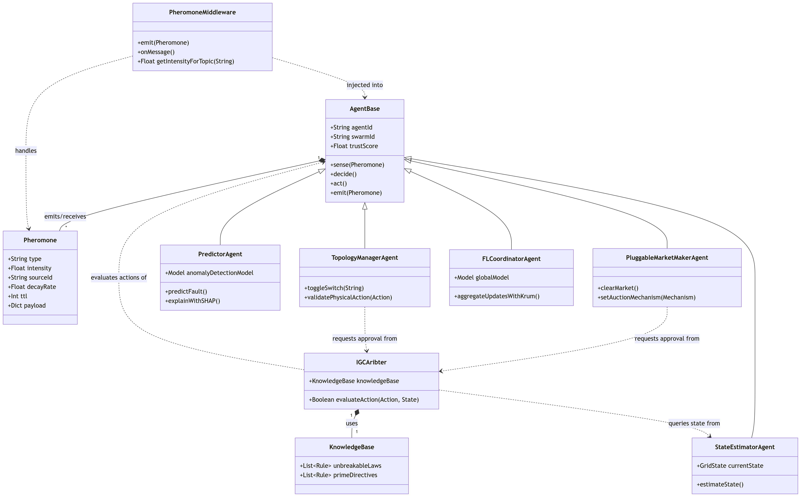

## Diagram 3
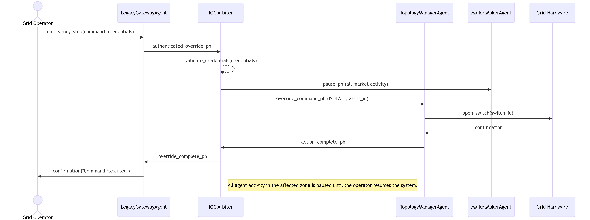

## Diagram 4
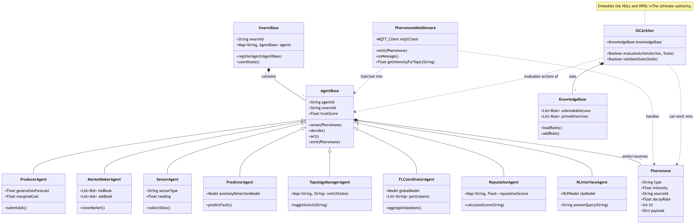

## Diagram 5
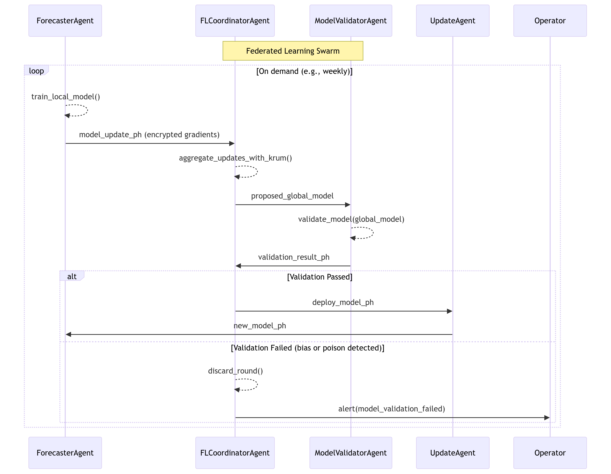

## Diagram 6
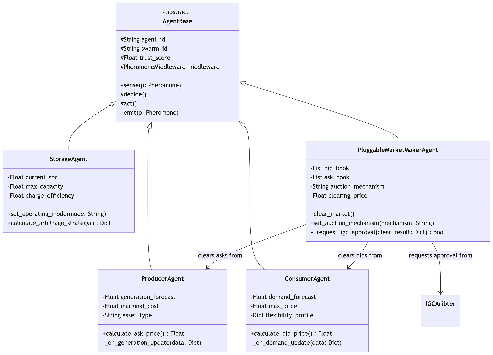

## Diagram 7
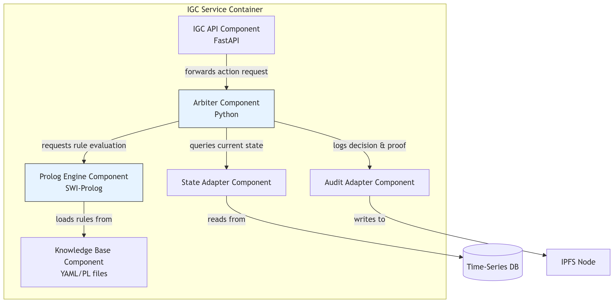

## Diagram 8
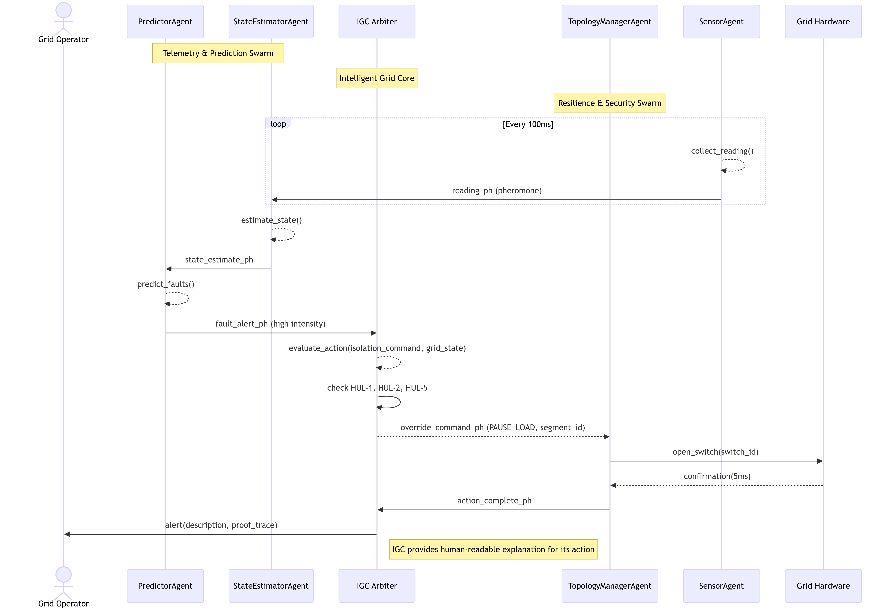

## Diagram 9
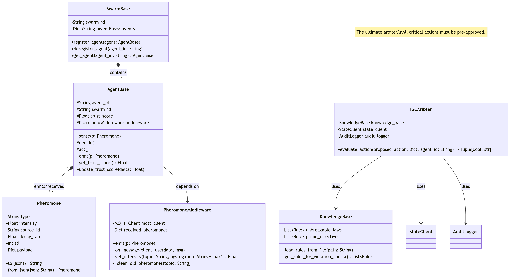

## Diagram 10
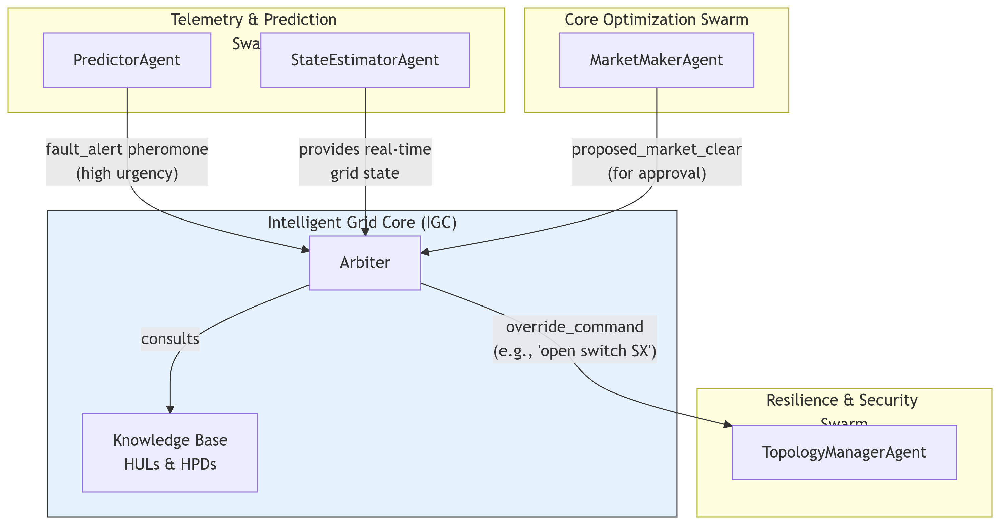

## Diagram 11
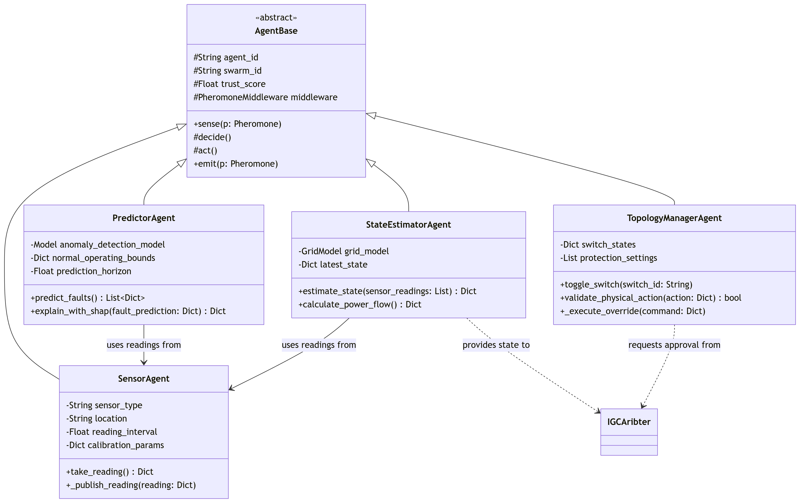

## Diagram 12
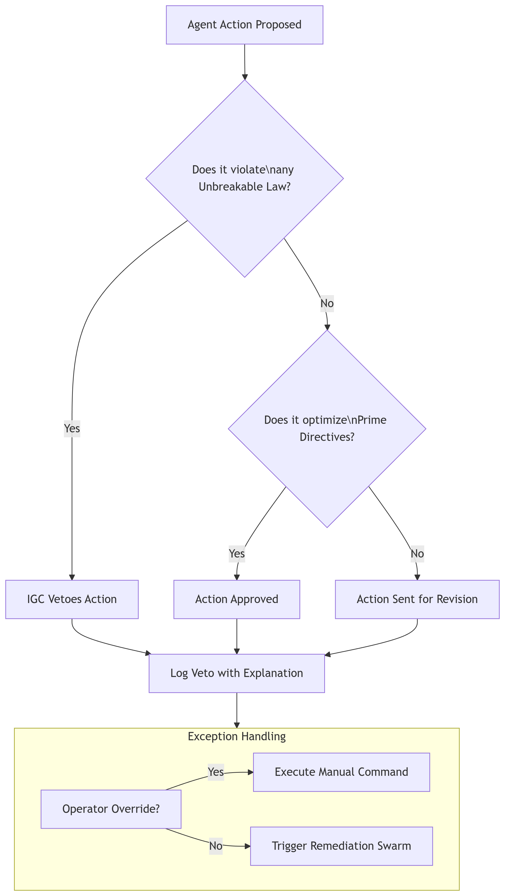

## Diagram 13
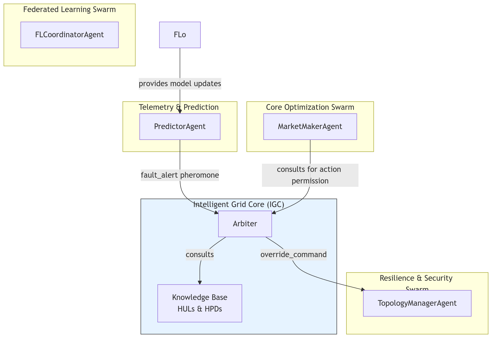
